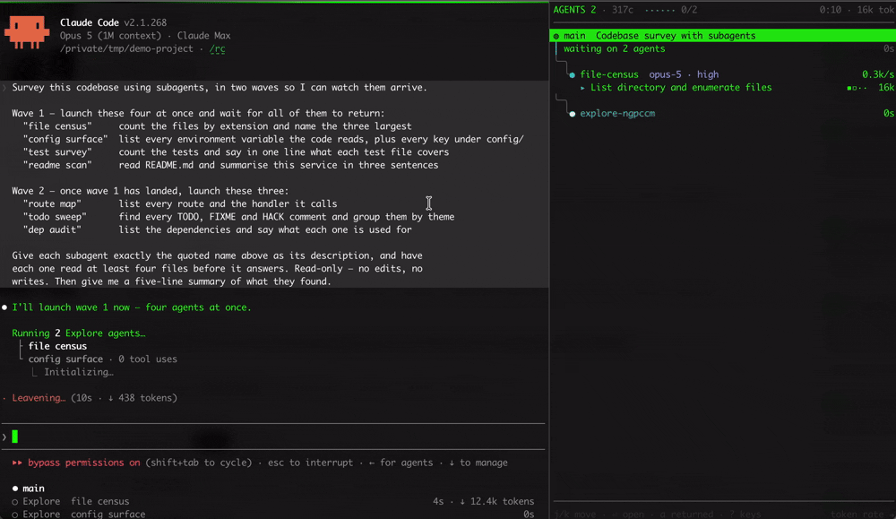

# agentpane



Another terminal UI harness. Written in Go. With a tree in it. Yes, I know.

Claude Code fans out to eight subagents and the transcript turns into a wall of
scrolling text. Worse, one of them hits a permission prompt and then just waits,
silently, while you are looking at a different window.

agentpane draws the tree live in a second pane. One row per agent, what it is
doing right now, and a flag when something is blocked on you.

It is read-only. It cannot send prompts, edit your files, or kill an agent.

MIT licensed, commercial use included. See [LICENSE](LICENSE).

## Install

```sh
curl -fsSL https://raw.githubusercontent.com/simoncoombes/agentpane/main/get.sh | sh
agentpane install
```

A binary into `~/.local/bin`, then the hooks into `~/.claude/settings.json`. The
installer shows you the diff and asks first. Add `--autopane` and the pane opens
itself with every session, in iTerm2, tmux, WezTerm, kitty or Windows Terminal.
Undo it all with `agentpane install --uninstall`.

Then run `agentpane` in a second pane next to your session.

* `agentpane --demo` replays a fan-out. No install, no Claude.
* `agentpane doctor` says what is wrong when nothing shows up.
* `go install github.com/simoncoombes/agentpane/cmd/agentpane@latest` if you
  would rather build it.
* `agentpane --source codex` watches an OpenAI Codex run instead.

On **Windows**, `get.sh` is not the route — `go install` it, or unzip a
release — and then `agentpane install --autopane` works the same from
PowerShell, splitting Windows Terminal. See
[docs/INSTALL.md](docs/INSTALL.md#windows).

## The marks

```text
AGENTS 7 · 3f9c  ▇▇···· 5/11                               ⚑ 2 NEEDS YOU
────────────────────────────────────────────────────────────────────────
◍ main  refactor auth                                               112k
│ holding 2 agents · waiting on you                                   5s
├─╮
│ ╰⚑ fix-ts2345-fallout  ↺2                                    ▇▇▇▇· 52s
│    Fix the TS2345 fallout in api handlers
│      ⚑ permission request  52s  +6 more
│    ▸ blocked · asked to clear the TS cache  ✖ verify failed  ▪▪▫·  44k
├─╮
│ ╰⚑ typecheck-works…                                              2m50s
│      ✔ Edit session.ts  +11 −2  +3 more
│    ▸ no call open · silent 2m50s                             ▪▪▫·  33k
├─╮
│ ╰● run-auth-tests                                      ◐ in Bash 3m12s
│      ✔ Bash pnpm test --filter auth --run  +1 more
│    ▸ Bash pnpm test --watch                                  ▪▫··  38k
├─╮
│ ╰● audit-users-schema                                           0.1k/s
│      ✔ Read indexes.ts  +5 more
│    ▸ Grep "createUser" src/**                                ▪▪▫·  52k
├─╮
│ ╰● write-email-index                                            0.3k/s
│      ✔ Edit 0042.sql  +30 −2  +4 more
│    ▸ Edit 0042.sql                                           ▪▪▫·  86k
├─╮
│ ╰○ document-constr…  queued
╰─╮
  ╰◇ reviewer  limited telemetry

RETURNED 5
────────────────────────────────────────────────────────────────────────
  scan-migrations                                              3:56  47k
  lint-and-format                                              3:56  47k
  port-session-he…                                             2:54  31k
  check-schema-drift                                           1:51  22k
  inventory-flags                                              1:08  19k
────────────────────────────────────────────────────────────────────────
⇥ jump to the session pane to answer                  34 quiet · s lists
```

`⚑` blocked on you · `●` running · `○` queued · `◇` teammate, reports almost
nothing · `▪▪▫·` how far it got · the number on the right is tokens

Every agent gets a name, the calls it has already made, and the call it is in
now. The `✔` lines are history and drawn dim, the `▸` line is what is happening
this second. `fix-ts2345-fallout` has been stopped on a permission request for
52 seconds. `typecheck-works` carries the other flag the header is counting,
because nothing has come out of it for 2m50s. `run-auth-tests` has been inside
the same `pnpm test --watch` for 3m12s, which is what an agent that started a
watcher by mistake looks like.

The right column is tokens, or the burn rate in `k/s` while a call is open. `t`
swaps it for time since the last event. `↺2` counts retries, and `✖ verify
failed` is a test or build command that exited non-zero.

Under the tree, `RETURNED` lists what has finished, newest first, with how long
each one ran and what it cost. It holds ten rows and scrolls with `j`/`k`. The
`34 quiet` in the footer counts the subagents Claude Code announced that never
ran a tool or spent a token, which `s` lists in full.

`⏎` inspects a row, `⇥` jumps to the session pane to answer whoever is blocked,
`a` shows the agents that finished, `?` lists the rest.

The tree draws at whatever width the pane is, up to 100 columns, and redraws
when you drag the divider. `w` fixes it at 64 or 44 instead.

Nothing on a row is a guess. The two marks that are inferred say so, and an
agent that reports nothing gets a dim row rather than an invention.

## Docs

* [READING-THE-PANE.md](docs/READING-THE-PANE.md). Every glyph, every
  animation, and what the pane won't tell you.
* [CLI.md](docs/CLI.md). Every flag, key and config setting.
* [INSTALL.md](docs/INSTALL.md). The installer, the hook snippet, auto-open.
* [TERMINALS.md](docs/TERMINALS.md). Which terminals can open the pane for
  you, and what to do in the ones that cannot.
* [ITERM2.md](docs/ITERM2.md). iTerm2 profiles and the split.
* [CODEX.md](docs/CODEX.md). Watching a Codex run.
* [DATA-SOURCES.md](docs/DATA-SOURCES.md). What it reads, and how fast.
* [CONTRIBUTING.md](CONTRIBUTING.md) · [SECURITY.md](SECURITY.md)
